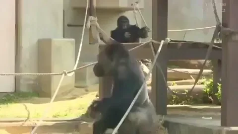

# **THE ULTIMATE LICENSE OF ULTIMATE FREEDOM (BUT WITH CHICKEN NOISES AND APE BEHAVIOR)**

## **ARTICLE 1: GRANT OF LICENSE**

In consideration of your agreement to the terms and conditions set forth below, we, the licensers, hereby grant you, the licensee, a non-exclusive, worldwide, perpetual, irrevocable, and totally-unbelievably-amazing license to use, modify, distribute, and make silly faces while using our software (the "Software").

## **ARTICLE 2: CONDITIONS OF USE**

You agree to use the Software only for good, not evil. However, if you do use it for evil, we won't judge you (much). You may use the Software for any purpose, including but not limited to:

* World domination
* Baking a cake
* Solving world hunger (but only if you're feeling extra motivated)
* Creating an AI that takes over the world (just kidding, please don't do that)

## **ARTICLE 3: CHICKEN NOISES**

In consideration of the incredible flexibility and awesomeness of this license, you agree to record a YouTube video of yourself making funny chicken noises (including but not limited to "Bock! Bock!", "Cluck cluck!", and "Squawk! Squawk!") for a minimum of 5 minutes and 37 seconds. This video must be uploaded to YouTube with the title "I [Your Name] Accept the Ultimate License of Ultimate Freedom!" and must include a shot of you holding a (real or fake) chicken.

## **ARTICLE 4: APE BEHAVIOR**

If, at any point, your use of the Software results in damage, injury, or any negative consequences whatsoever to yourself or others, you agree to record a YouTube video of yourself behaving like an ape, making ape noises (including but not limited to "Ooh ooh ah ah!", "Ee ee ee!", and "Hoo hoo ha ha!"), and performing ape-like actions (such as jumping up and down, scratching yourself, and/or knocking over a fake tree). This video must be uploaded to YouTube with the title "Oops, I Did It Again! " and must include a shot of you wearing a fake ape costume.

## **ARTICLE 5: DISCLAIMER OF WARRANTIES**

We disclaim all warranties, express or implied, including but not limited to the implied warranties of merchantability, fitness for a particular purpose, and non-infringement. YOU USE THE SOFTWARE AT YOUR OWN RISK. WE'RE NOT RESPONSIBLE FOR ANYTHING. (Except for making you laugh with this license, which is explicitly guaranteed.)

## **ARTICLE 6: GOVERNING LAW**

This license shall be governed by and construed in accordance with the laws of the Land of Silliness, a sovereign nation located in the realm of our imagination.

## **ARTICLE 7: ENTIRE AGREEMENT**

This license constitutes the entire agreement between the parties and supersedes all prior or contemporaneous agreements or understandings. You agree that you have read, understood, and laughed at this license, and that you're ready to make some hilarious chicken noises and ape-like behavior.

By using the Software, you acknowledge that you have read, understood, and will comply with the terms and conditions of this license.

Now, go forth and make us laugh!